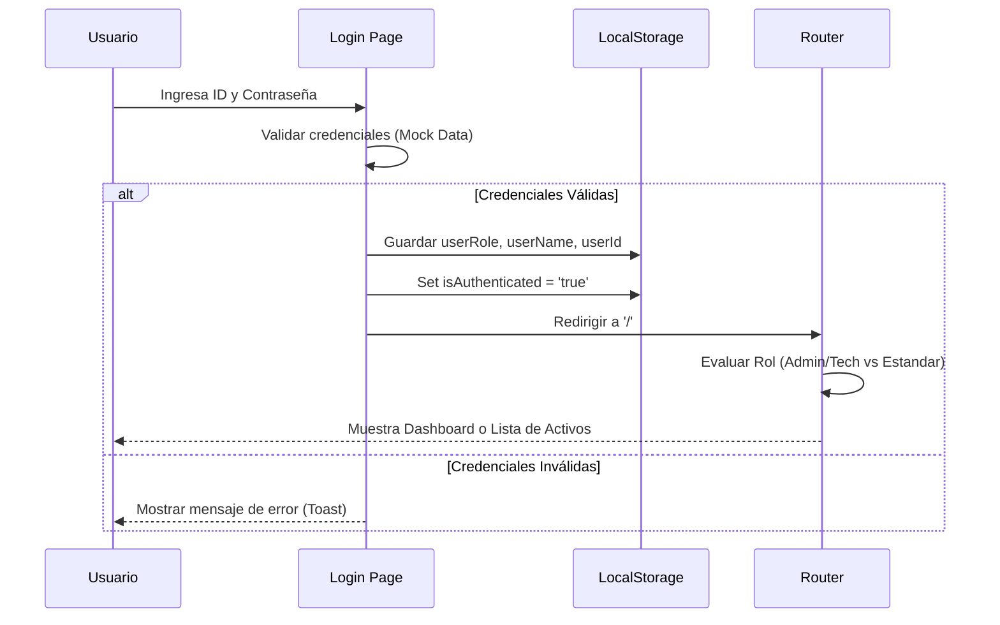
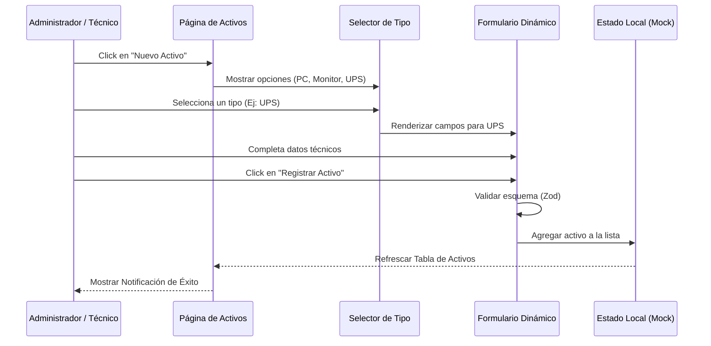
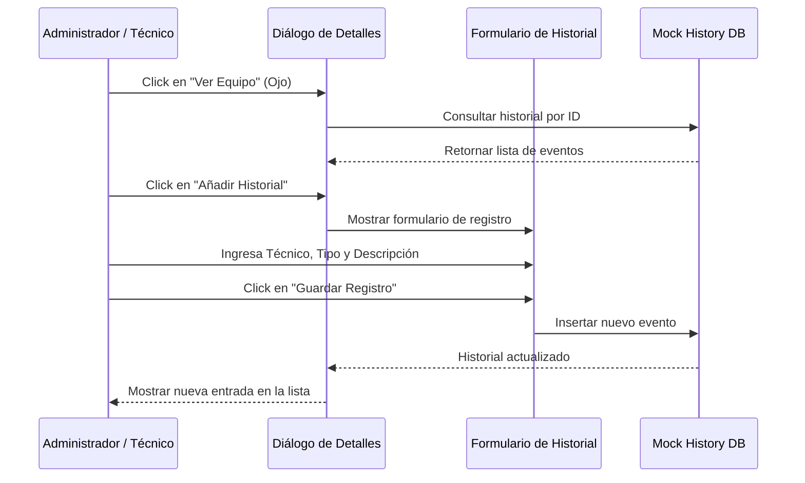
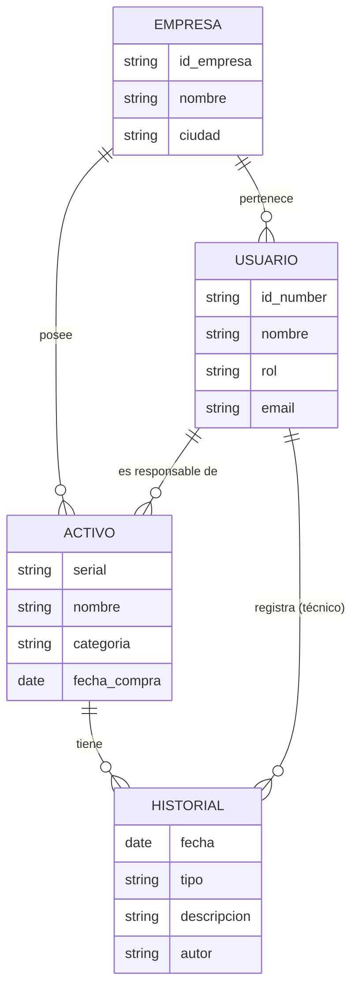

# Diagramas de Análisis - Activos Pro

Este documento contiene diagramas que refuerzan el análisis funcional y técnico de la aplicación, permitiendo visualizar la interacción entre los componentes del sistema.

## 1. Diagrama de Secuencia: Autenticación (Login)

Este diagrama describe el flujo desde que el usuario ingresa sus credenciales hasta que es redirigido al panel correspondiente según su rol.

---

## 2. Diagrama de Secuencia: Registro de Nuevo Activo

Muestra la interacción necesaria para ingresar un nuevo equipo al inventario, incluyendo la selección dinámica de formularios.

---

## 3. Diagrama de Secuencia: Gestión de Historial (Hoja de Vida)

Ilustra cómo se registra un evento de mantenimiento o incidente en la hoja de vida de un activo existente.

---

## 4. Diagrama de Arquitectura de Datos (Simplificado)

Relación entre las entidades principales del sistema.

