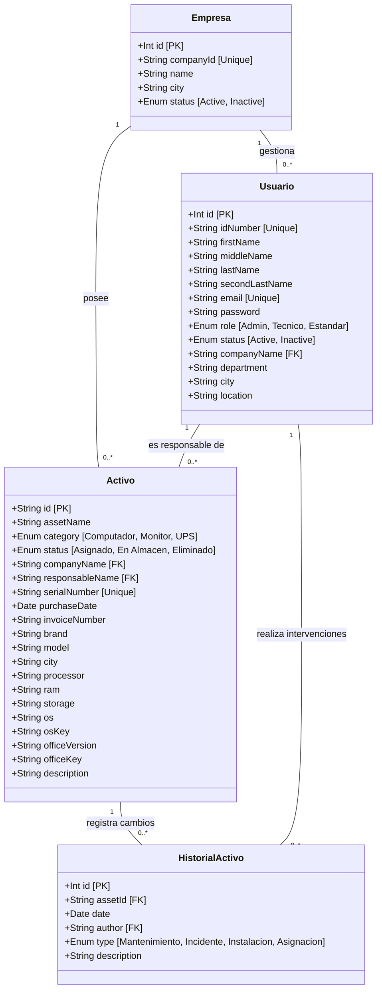
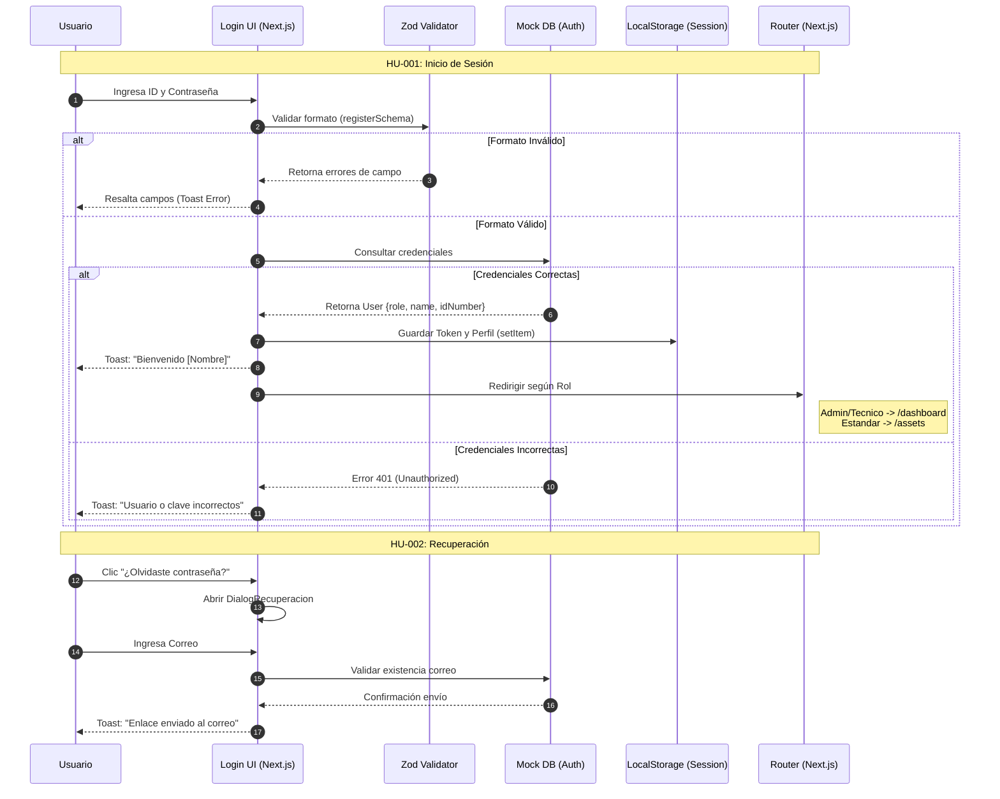
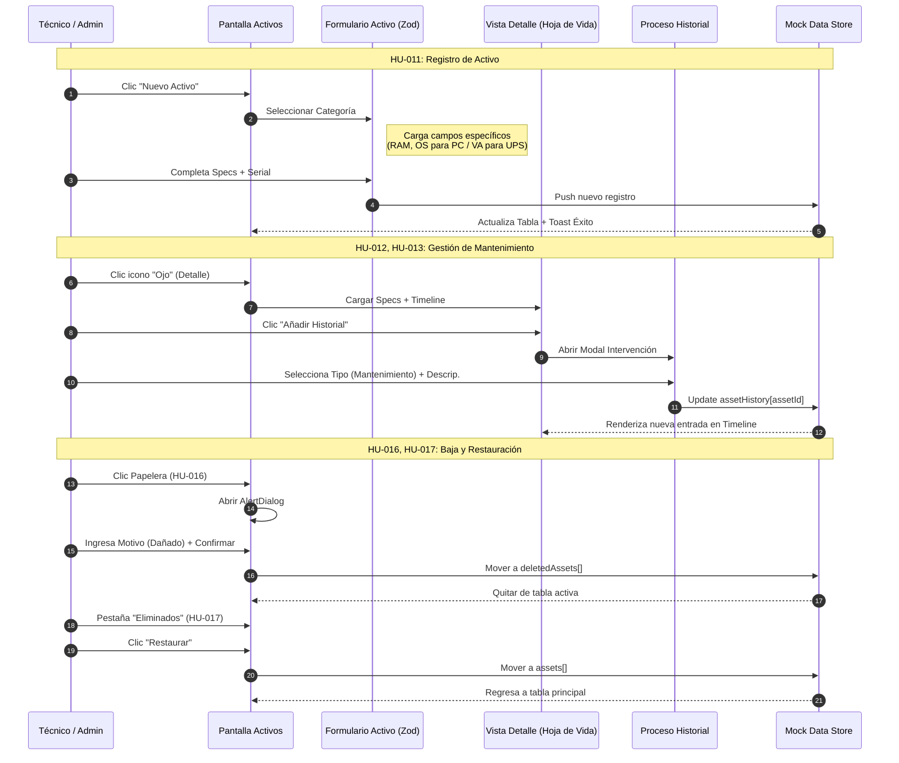
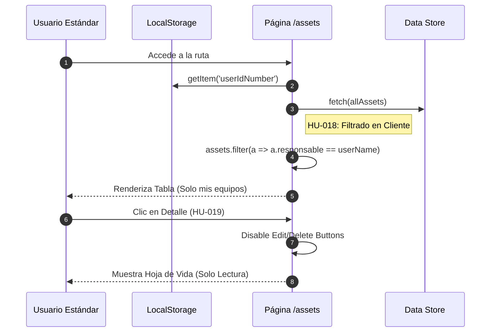

# Diagramas Técnicos de Análisis - Activos Pro (Proyecto de Grado)

Este documento contiene la representación técnica avanzada de la arquitectura de software y los procesos del sistema, vinculados a las Historias de Usuario (HU).

---

## 1. Diagrama de Clases (Estructura de Datos)
Este diagrama representa el modelo de datos robusto, definiendo atributos, tipos y relaciones de integridad referencial.

---

## 2. Proceso de Autenticación y Seguridad (HU-001, HU-002)
Detalla el flujo desde la interfaz hasta la validación de roles y persistencia de sesión.

---

## 3. Gestión Integral de Activos y Trazabilidad (HU-011 a HU-017)
Ciclo de vida técnico de un equipo, incluyendo mantenimiento y bajas lógicas.

---

## 4. Lógica de Privacidad: Rol Estándar (HU-018, HU-019)
Muestra cómo el sistema restringe datos basándose en la identidad del usuario logueado.

