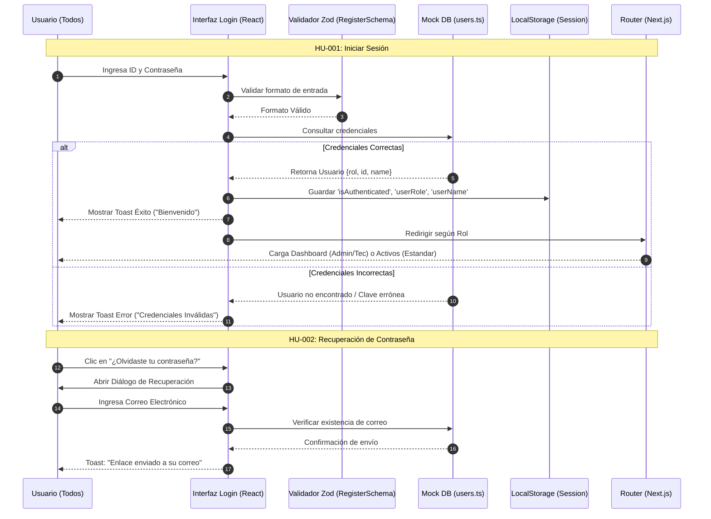
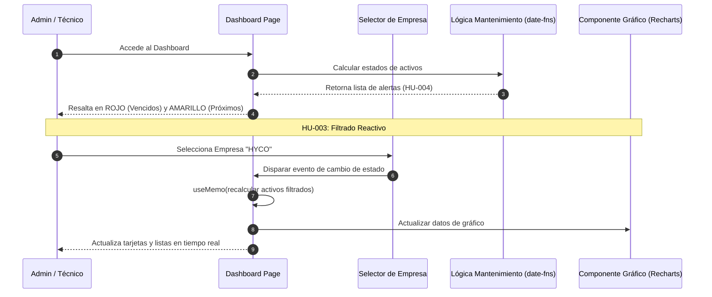
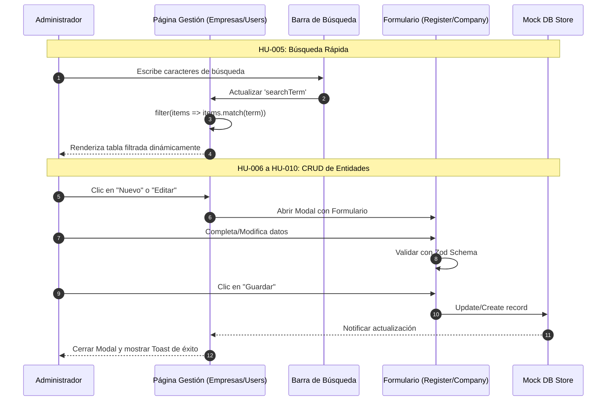
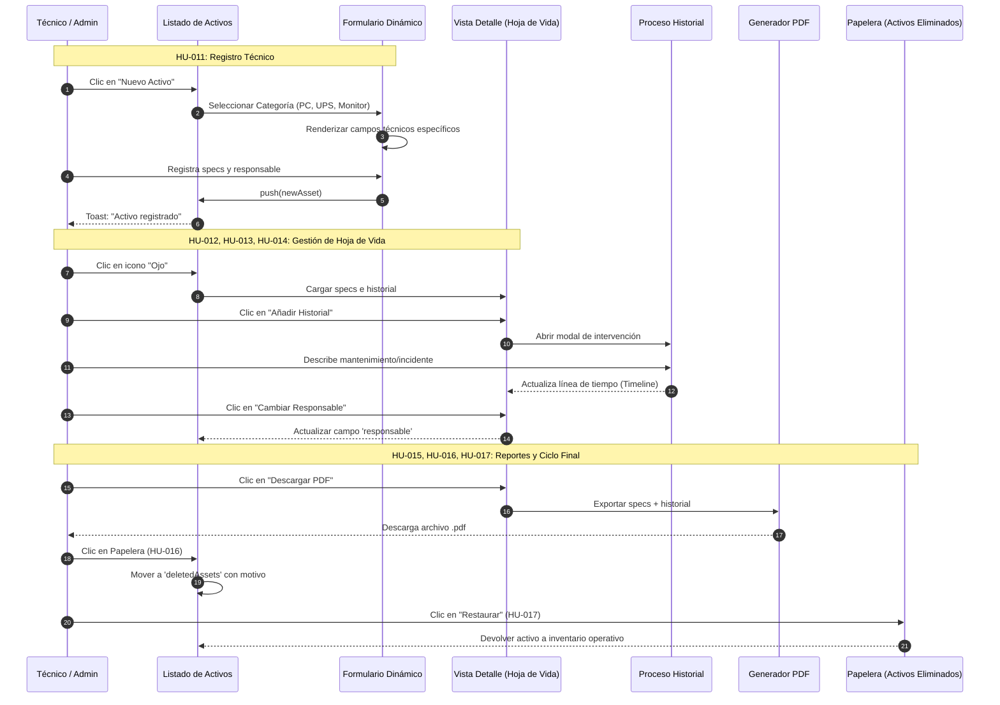
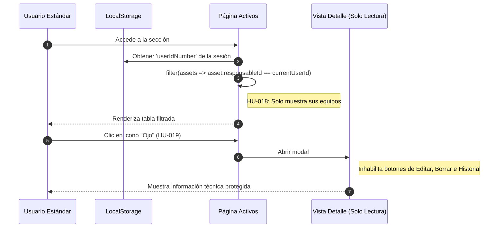

# Diagramas Técnicos de Análisis - Activos Pro (Proyecto de Grado)

Este documento contiene la representación técnica de los procesos fundamentales del sistema "Activos Pro", vinculados directamente a las Historias de Usuario (HU) definidas en el análisis de requerimientos.

---

## 1. Proceso de Autenticación y Recuperación (HU-001, HU-002)
Este diagrama detalla el acceso seguro al sistema y la lógica de protección de rutas basada en roles.

---

## 2. Inteligencia de Negocio en Dashboard (HU-003, HU-004)
Detalla la reactividad del sistema ante filtros y el cálculo dinámico de alertas de mantenimiento.

---

## 3. Gestión de Entidades: Empresas y Usuarios (HU-005 a HU-010)
Ciclo de vida de empresas y gestión de personal.

---

## 4. Gestión Integral de Activos (HU-011 a HU-017)
Detalla el proceso técnico, trazabilidad y control de inventario de equipos.

---

## 5. Visualización Restringida: Rol Estándar (HU-018, HU-019)
Muestra cómo el sistema filtra la información para garantizar la privacidad y seguridad.

