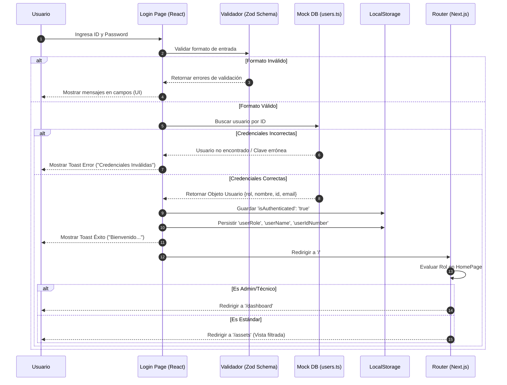
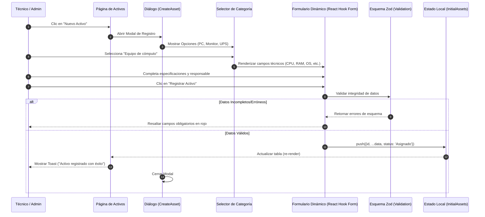
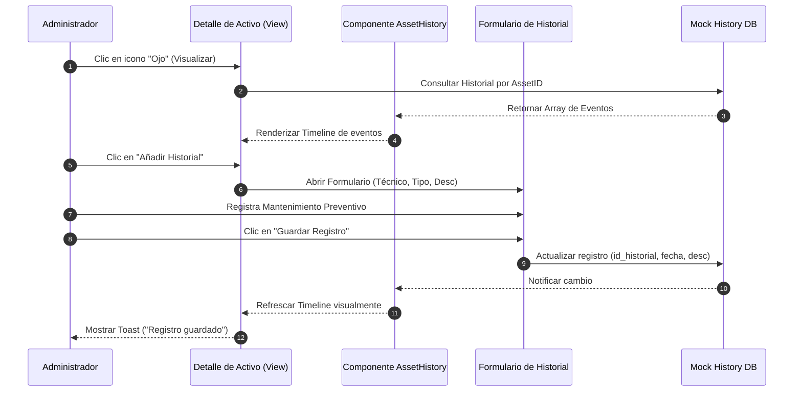
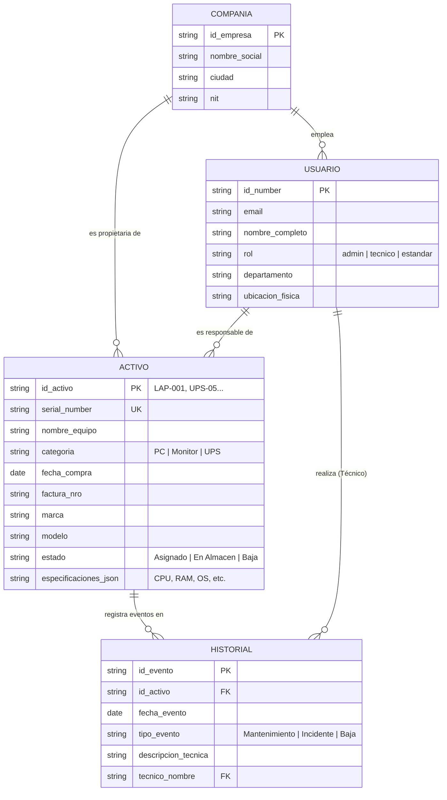

# Diagramas de Análisis Detallado - Activos Pro (Proyecto de Grado)

Este documento contiene la representación técnica y lógica de los procesos fundamentales del sistema "Activos Pro". Estos diagramas están diseñados para sustentar la arquitectura de software y el flujo de datos del proyecto.

## 1. Diagrama de Secuencia: Autenticación y Control de Acceso
Este diagrama detalla el proceso desde el intento de acceso hasta la persistencia de la sesión y la protección de rutas basada en roles (RBAC).

---

## 2. Diagrama de Secuencia: Registro de Activo con Lógica Dinámica
Detalla el flujo de creación de activos, resaltando la selección de formularios específicos según la categoría técnica.

---

## 3. Diagrama de Secuencia: Gestión de Hoja de Vida e Historial
Muestra cómo se mantiene la trazabilidad de un equipo a través de eventos de mantenimiento preventivo o correctivo.

---

## 4. Modelo Entidad-Relación Detallado (ERD)
Arquitectura de datos que soporta la integridad referencial y el seguimiento de activos.

