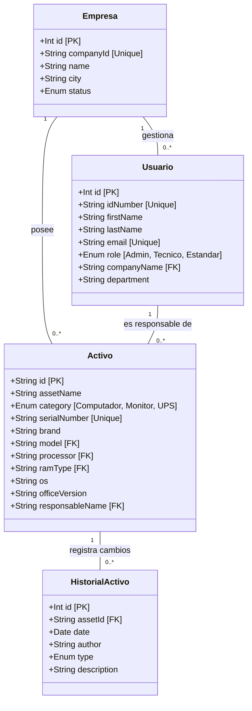
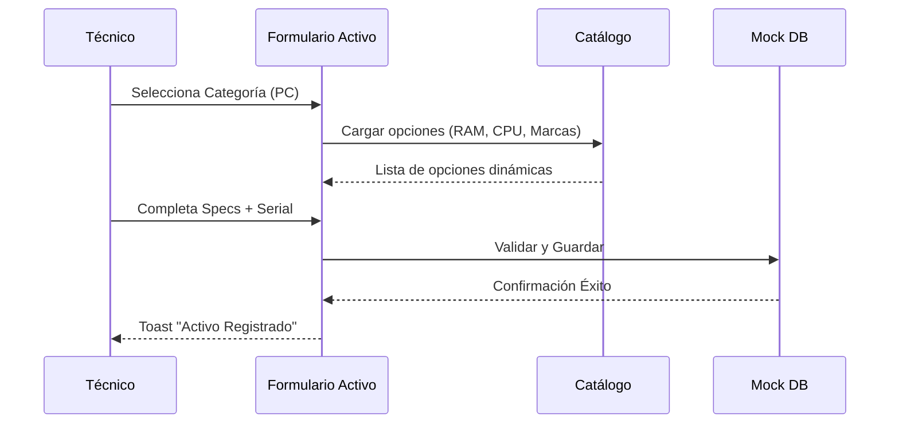

# Diagramas Técnicos de Análisis - Activos Pro (Proyecto de Grado)

## 1. Diagrama de Clases UML (Estructura de Datos)

```mermaid
classDiagram
    class Empresa {
        +Int id [PK]
        +String companyId [Unique]
        +String name
        +String city
        +Enum status
    }

    class Usuario {
        +Int id [PK]
        +String idNumber [Unique]
        +String firstName
        +String lastName
        +String email [Unique]
        +Enum role [Admin, Tecnico, Estandar]
        +String companyName [FK]
        +String department
    }

    class Activo {
        +String id [PK]
        +String assetName
        +Enum category [Computador, Monitor, UPS]
        +String serialNumber [Unique]
        +String brand
        +String model [FK]
        +String processor [FK]
        +String ramType [FK]
        +String os
        +String officeVersion
        +String responsableName [FK]
    }

    class HistorialActivo {
        +Int id [PK]
        +String assetId [FK]
        +Date date
        +String author
        +Enum type
        +String description
    }

    Empresa "1" -- "0..*" Usuario : gestiona
    Empresa "1" -- "0..*" Activo : posee
    Usuario "1" -- "0..*" Activo : es responsable de
    Activo "1" -- "0..*" HistorialActivo : registra cambios
```

## 2. Diagrama de Secuencia: Registro de Activo (HU-011)

```mermaid
sequenceDiagram
    participant T as Técnico
    participant UI as Formulario Activo
    participant C as Catálogo
    participant DB as Mock DB

    T->>UI: Selecciona Categoría (PC)
    UI->>C: Cargar opciones (RAM, CPU, Marcas)
    C-->>UI: Lista de opciones dinámicas
    T->>UI: Completa Specs + Serial
    UI->>DB: Validar y Guardar
    DB-->>UI: Confirmación Éxito
    UI-->>T: Toast "Activo Registrado"
```